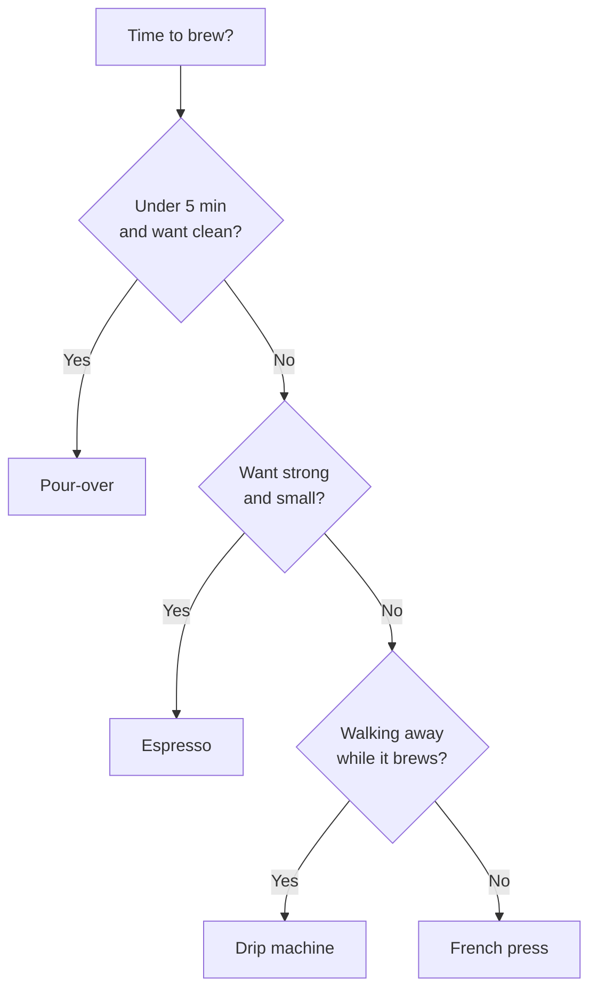

# Pick a Method

The right brewing method is the one that fits your morning. Time you have, gear you own, and how clean the cup needs to taste. Pick by those three. Skip the brand wars.

## The Decision

Most home brewers pick a method by what is on the counter. That is fine until the counter changes. A better rule is to pick by what your morning needs.

The method decision in one diagram:

Pour-over is the default for a clean cup in five minutes or less. Espresso is right when you want concentrated coffee in a small volume and own a machine that can pull a real shot. Drip is right when you are doing other things at the same time. French press fits the mornings where you want body and you do not mind the brew sitting for four minutes.

## How to Use the Rule

The rule is not a contract. Treat it as a starting point. If you wake up tired and the pour-over kettle is dirty, the drip machine is the better choice that day. The point of the diagram is not to lock you in. The point is to stop you from buying gear you do not need because somebody on the internet said pour-over is the only real way.

Run through the diagram once a week for a month. After that you will have a default that fits your kitchen, and you will only revisit the rule when something changes.

## What this means for you

You can pick a method without owning every piece of gear. The decision is short, and the answer changes when your morning changes.

Buy one good thing, learn it, and add gear only when the morning asks for it.
