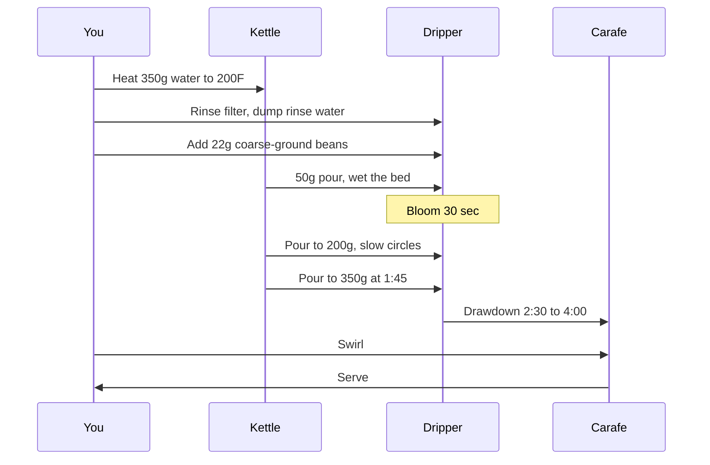

# The Brew

A pour-over takes four minutes once you know the order. The order matters because each step relies on the one before it. Skip a step and the cup goes flat or bitter or sour. The fix is mechanical: do the steps in order, on time.

## The Sequence

The actors are you, the kettle, the dripper, and the carafe. Each speaks at the right moment. The diagram below tracks the conversation from grind to serve.

The brew as an exchange between you and the gear:

The bloom is the first thirty seconds. Coffee releases trapped CO2 the moment hot water hits it; pour all the water at once and the gas pushes the water back up out of the bed before it can extract anything. A short rest with just enough water to wet the grounds lets the gas escape, and the rest of the pour can do its job.

## What the Numbers Mean

A 350-gram brew at 200F using 22g of beans is a 1:16 ratio, which is the standard pour-over starting point. Heavier ratio (more water per gram) makes a thinner cup. Lighter (less water) makes a stronger cup. Adjust by 1g of beans at a time, not by changing the water. Water is your control variable.

Try a few ratios in the explorer:

{{microsim: brew-ratio-explorer.html height=540}}

Drawdown is the part where you stop pouring and the dripper finishes draining on its own. A drawdown longer than two minutes means the grind is too fine. Shorter than ninety seconds means too coarse. Coarsen up if the cup is bitter, fine down if it is sour.

## What this means for you

A pour-over is a sequence, not a recipe. Hold the order, hold the times, and the cup is in your control.

The next bag of beans you buy will tell you what to expect; the lesson on reading a bag is up next.
