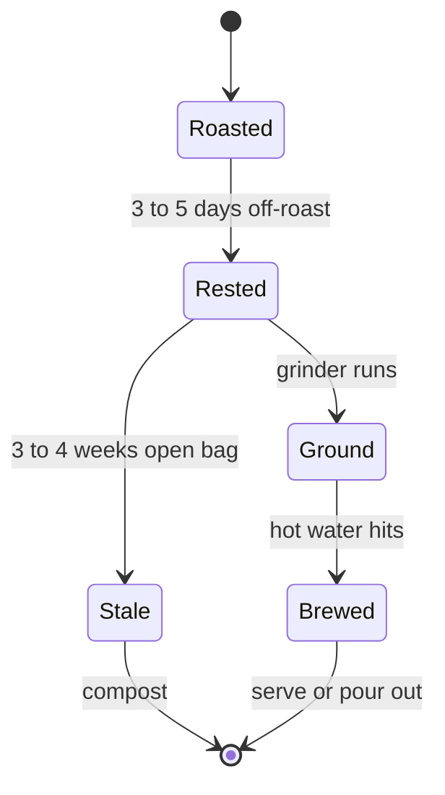

# The Bean

A coffee bean lives through four states between the roaster and your cup. Each state has a window where it tastes best. Buy beans without knowing the windows and you are guessing why the cup is off.

## The Four States

The bean's lifecycle, with the cue that triggers each transition:

A bag fresh off the roaster smells like the roaster: smoky, intense, a little harsh. That is the Roasted state. Beans tasted at this stage often taste flat in the cup because the CO2 in the bean is fighting extraction. Rest the bag on the counter for three to five days. The smell softens and the flavors come forward. That is the Rested window, the four weeks where the bean tastes best.

After about a month in an open bag, the oils on the surface turn rancid and the cup goes flat-and-papery. That is Stale. Stale beans still brew, they just do not taste like coffee should taste. Compost them or use them as a planter mulch.

## When to Grind

Grinding is the transition that should happen as close to brewing as possible. Once a bean is ground, the surface area exposed to air is fifty times larger than the whole bean. Oxidation that took weeks on the whole bean now takes minutes on the grounds. A pre-ground bag bought at the grocery store is already most of the way to Stale before you open it.

Buy whole beans. Grind for one brew at a time. The investment is one good grinder, used every morning, for years.

## What this means for you

You can read a bag now. The roast date on the bag tells you which state the bean is in: just-roasted is Roasted, three to five days later is Rested, a month later is Stale.

If the bag has no roast date, treat it as Stale on the day you bought it.
