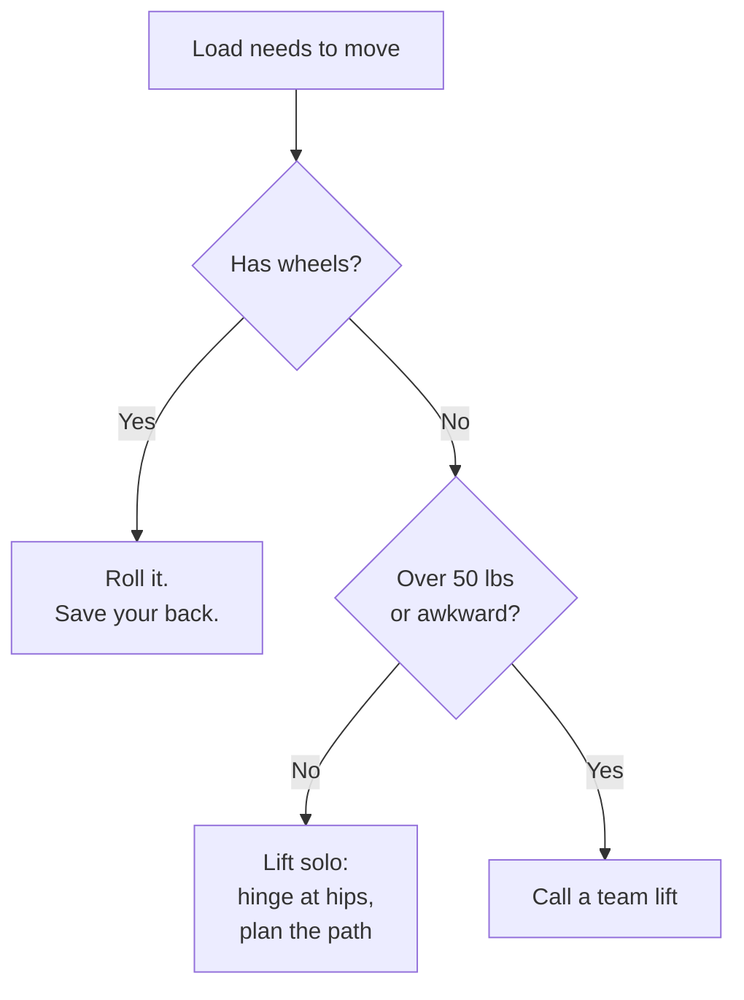

# Diagram Builder

Adds Mermaid diagrams to existing lessons. The skill reads each lesson, identifies one to three places where a diagram would teach better than prose, drafts the Mermaid syntax in the course's voice, and inserts the diagram inline with a brief intro line above it.

## When to Use

After lessons in a unit are drafted (lesson-drafter ran), run diagram-builder to enrich them with visuals. The skill is non-destructive at the prose level: it inserts Mermaid blocks, it does not rewrite paragraphs.

Use this skill before sync. The HTML preview generator and static-web sync target render Mermaid via the CDN. Lessons that ship without diagrams are fine; lessons with broken Mermaid syntax are not, so this skill is a checkpoint.

Do NOT use this skill if:
- The unit has no lessons yet (run lesson-drafter first)
- `voice-guide.md` has not been filled in (the diagrams' intro lines and node labels follow voice rules)
- The unit's lessons already have hand-authored diagrams the user does not want disturbed (the skill respects existing Mermaid blocks but check first if you are unsure)

## Verify Don't Think

This skill follows the verify-don't-think pattern. Every step has a concrete check. The skill never guesses. If a check fails, stop and tell the user, do not paper over it.

## Steps

1. Verify required files exist:
   - `course-config.yaml`, `course-description.md`, `voice-guide.md` at the course root
   - The unit folder `content/unit-NN-{slug}/` (one folder, or every unit folder if no `unit_number` was passed)
   - At least one lesson markdown in `lessons/`

2. Read context, the same way lesson-drafter and quiz-builder do:
   - From `course-description.md`: audience, learning outcomes
   - From `voice-guide.md`: voice rules (especially anything about visuals, captions, or formality)
   - From `unit.yaml`: unit title, unit-level outcomes
   - From every lesson markdown in the unit: the actual lesson body

3. For each lesson, decide whether a diagram would add learning value. The bar is high. A diagram earns its place only if it teaches something prose cannot teach as cleanly.

   **Add a diagram when:**
   - The lesson describes a process with branching decisions (flowchart)
   - The lesson describes an interaction between two or more parties over time (sequence)
   - The lesson describes a thing that lives in different states (state)
   - The lesson describes a structured collection of related entities (class diagram, relationship map)
   - The lesson contains a passage like "the steps are: A, then B, then C" that is structurally a list of nodes with arrows

   **Do NOT add a diagram when:**
   - The lesson is purely narrative or motivational
   - The lesson is about a single concept with no internal structure (definitions, single facts)
   - A diagram would just re-list what a paragraph already says clearly
   - The diagram would be five disconnected nodes (that is a bullet list, not a diagram)

   See `diagram-patterns.md` for the full pattern catalog with examples.

4. For each candidate spot, choose the diagram type. Default to `flowchart` for branching processes, `sequenceDiagram` for cross-actor interactions, `stateDiagram-v2` for lifecycle questions, `classDiagram` for structural relationships. Stick to types in `allowed_types` unless the user opts in to others.

5. Draft the Mermaid syntax. See `mermaid-syntax-reference.md` for the supported subset and the patterns that render reliably across CDN versions. Hard rules:
   - Node labels are short, readable, and in the voice of the lesson. No jargon the lesson did not introduce.
   - Edges have labels only when the label adds information ("yes" / "no" on a decision branch, "build done" on a transition, "1.5 hours" on a sequence).
   - No more than ~12 nodes per diagram. If the diagram needs more, the lesson likely needs to be split, not the diagram crammed.
   - No HTML inside node labels except `<br/>` for line breaks. Do not use `&` or `|` inside labels (escape with quotes if you must).
   - Diagram has to render under the brand theme variables (white background, near-black text, magenta D6006C borders). Avoid fill color overrides unless they materially help.

6. Pick the insertion point. The diagram goes where the lesson first introduces the concept it diagrams. Specifically:
   - After the H4 (or H3) heading whose section is about the diagrammed concept
   - And after the first paragraph of that section, so prose sets up the diagram
   - Never as the very first thing in the lesson (the takeaway-first sentence comes first)
   - Never after the "What this means for you" wrap section

7. Write the diagram inline as a fenced ` ```mermaid ` block with a one-sentence intro line above it in the voice of the lesson:

   ```markdown
   The lift decision in one diagram:

   ```mermaid
   flowchart TD
       A[Load needs to move] --> B{Has wheels?}
       B -->|Yes| C[Roll it.<br/>Save your back.]
       B -->|No| D{Over 50 lbs<br/>or awkward?}
       D -->|No| E[Lift solo:<br/>hinge at hips,<br/>plan the path]
       D -->|Yes| F[Call a team lift]
   ```
   ```

   The intro line is a single sentence ending in a colon. No fanfare ("Here is a beautiful diagram showing..."). Match the voice guide.

8. Verify the diagram before writing:
   - The Mermaid syntax parses (see "Lint Pattern" below)
   - Every node referenced by an edge is defined
   - No node is orphaned (every node is reachable)
   - Node label characters are safe (no unescaped `|`, `&`, or unbalanced quotes)
   - Edge labels do not contain stray pipes
   - The diagram type declaration is the first non-blank line inside the block

9. Insert the diagram into the lesson markdown:
   - Read the existing file
   - Splice the intro line + Mermaid fence at the chosen insertion point
   - Preserve the rest of the file byte-for-byte
   - If the lesson already has a Mermaid block at the proposed spot, skip it and try a different spot or skip this lesson entirely

10. Set `draft: true` on the lesson's frontmatter if it is not already true, since the diagram counts as new draft content needing review.

11. After updating all targeted lessons, show the user a summary:
    - For each lesson modified: file path, number of diagrams added, the diagram types
    - For each lesson skipped: file path, reason (no good fit, already has diagrams, etc.)
    - Suggested next step: run `bes validate`, eyeball the preview HTML, then commit

## Output Format

A diagram inserted into a lesson looks like this:

```markdown
## How to Lift Solo

The spine is a stack of bones with cushiony discs between them. ...

The lift decision in one diagram:



The fix is mechanical. Hinge at the hips, not the lower back. ...
```

Note the intro sentence ending in a colon, the fenced block with `mermaid` as the language, and surrounding prose preserved. The H4 above and the next paragraph below are untouched.

## Lint Pattern

Before writing, the skill verifies the Mermaid syntax is valid by running these checks against the diagram string:

1. **First line** matches one of: `flowchart `, `graph `, `sequenceDiagram`, `stateDiagram-v2`, `classDiagram`, `erDiagram`, `journey`, `gantt`. (The skill rejects unknown types.)

2. **Edge nodes are defined.** Walk the edges; every node id on either side of an arrow either has a label definition (`A[Load]`, `B{Decision?}`, `C(Round)`) or has been referenced earlier in the diagram.

3. **No bare reserved characters** in node labels: no unescaped `|`, no unescaped `;`, no stray backticks. Wrap any label that contains punctuation in double quotes (`A["With a comma, like this"]`).

4. **Brackets balance.** Counts of `[` / `]`, `(` / `)`, `{` / `}` match within each label.

5. **No tabs or trailing whitespace** inside the Mermaid block. Mermaid renders most diagrams fine with tabs but the YAML-style indenters used by some Mermaid sub-syntaxes do not.

If any of these fail, the skill rewrites the diagram or skips the insertion. The skill never writes a Mermaid block that did not pass the lint.

## Examples

### Example 1: Live Event Technician Course, Unit 1, lifting lesson

Input: `unit_number=1`, default settings.

The lesson `03-lifting-without-hurting-yourself.md` describes a decision: does the load have wheels, is it over 50 pounds, do you lift solo or call a team. That is a flowchart.

Output: a single flowchart inserted under the "How to Lift Solo" H4, between the paragraph that introduces the spine and the paragraph that explains the deadlift hinge mechanics. Five nodes, two decision points, branches labeled yes/no.

### Example 2: High school geology, Unit 3, mineral identification lesson

Input: `unit_number=3`, default settings.

The lesson describes a step-by-step process: scratch test against fingernail, then penny, then glass, then steel knife, narrowing down hardness. That is a flowchart.

Output: a flowchart inserted under the procedural section, with one node per scratch test step and the resulting hardness range labeled on each branch.

### Example 3: Coaching course, Unit 4, in-game decision lesson

Input: `unit_number=4`, default settings, `allowed_types=["flowchart", "sequence"]`.

The lesson describes a coach-player exchange when a player asks a tactical question on the sideline. That is a sequence diagram.

Output: a sequence diagram with two participants (Coach, Player) and four arrows representing the exchange, inserted under the "What the conversation looks like" section.

## Quality Checks

Before declaring the skill done, verify:

- Every lesson modified parses as valid markdown (no broken frontmatter, headings still in order)
- Every Mermaid block in the modified files is syntactically valid by the lint pattern above
- No lesson has a diagram added in the bottom wrap section ("What this means for you")
- No lesson has more than `max_diagrams_per_lesson` diagrams added
- Every lesson with at least one diagrammable concept has at least `min_diagrams_per_lesson` diagrams (or a clear reason it was skipped)
- The voice of the intro lines matches the voice guide (skim for banned phrases, em dashes if forbidden, register mismatch)

## Common Mistakes

- **Adding a diagram to every lesson.** Most lessons do not benefit from a diagram. The skill defaults to `min_diagrams_per_lesson=1` but is allowed to skip a lesson if no spot earns a diagram. Restraint is the right call.

- **Dressing up a list as a diagram.** Five nodes connected only by a single arrow each ("A -> B -> C -> D -> E") is a bullet list. A diagram earns its place when it shows branching, looping, or cross-actor structure.

- **Writing diagrams in different voice from the lesson.** Node labels are part of the lesson's writing. If the voice guide says "no em dashes," node labels follow that. If the voice guide says "second person, direct," node labels say "Roll it" not "The user rolls the load."

- **Putting the diagram before the prose that sets it up.** The diagram is a summary or a synthesis, not the introduction. Always put a paragraph of prose first, then the intro sentence ending in a colon, then the diagram.

- **Decorative styling that fights the brand theme.** The Mermaid CDN is initialized with the brand theme variables (white background, near-black text, magenta border). Diagrams that override colors per-node usually look worse, not better. Default to no `style` lines.

- **Long node labels.** A label longer than ~30 characters wraps awkwardly. Break with `<br/>` or shorten the wording. The label's job is to remind the reader what the node is, not to teach the concept.

- **Failing the lint and writing anyway.** If the lint fails, the skill rewrites or skips. It does not write a broken block and hope. A broken Mermaid block renders as raw text on Thinkific and as a blank space on static-web. Both are worse than no diagram.

## Files in This Skill Folder

- `SKILL.md` (this file)
- `diagram-patterns.md` (which Mermaid type fits which content shape, with side-by-side examples)
- `mermaid-syntax-reference.md` (cheat sheet for the supported diagram types and the syntax that renders reliably across CDN versions)

## Changelog

### 1.0 (2026-05-04)
- Initial version
- Reads voice-guide and lessons; inserts Mermaid blocks where a diagram earns its place
- Lints Mermaid syntax before writing
- Sets `draft: true` so course-validator flags the lesson for review
