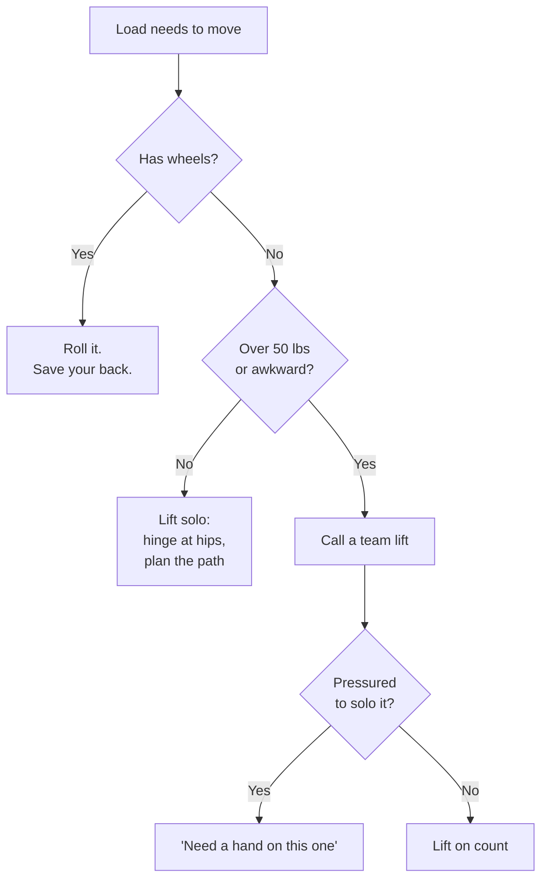
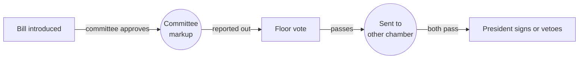
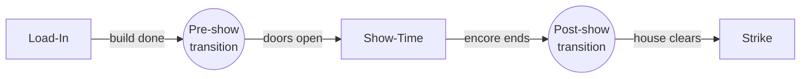
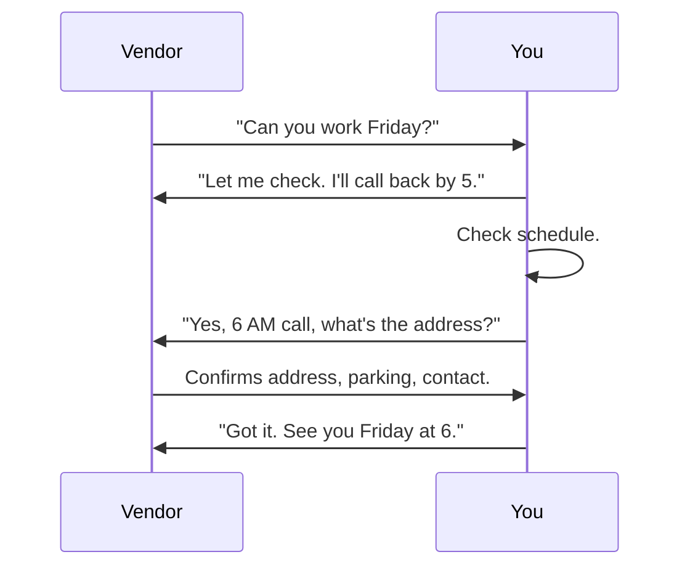
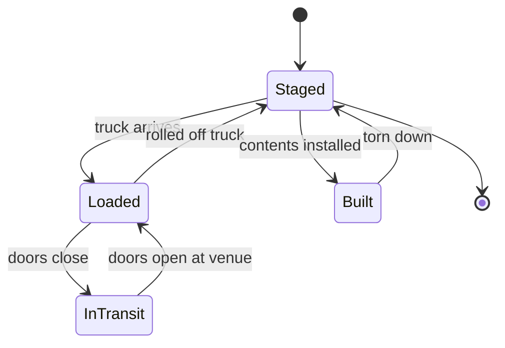
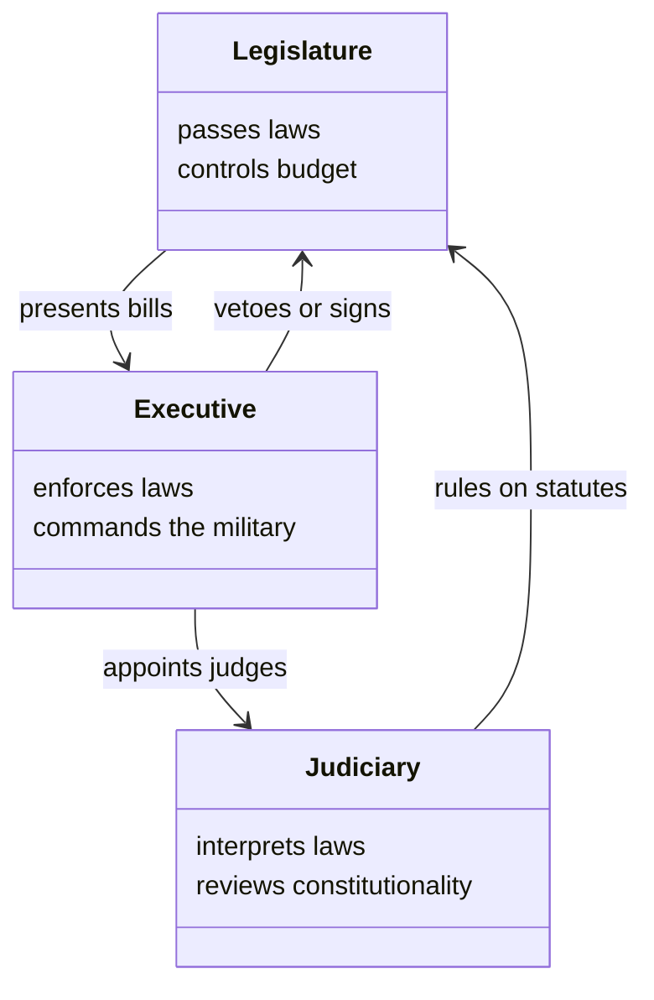
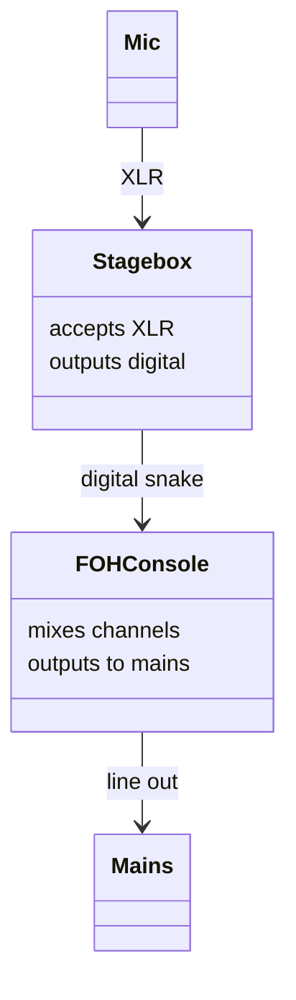

# Diagram Patterns

Reference for when to reach for which Mermaid type. Each pattern shows the content shape that calls for it, a worked example, and notes on what would be wrong with a different choice.

The default order of preference for picking a type:

1. **Flowchart** if the lesson describes a process, especially one with decisions.
2. **Sequence diagram** if the lesson describes an exchange between two or more parties over time.
3. **State diagram** if the lesson describes a thing that lives in different states.
4. **Class diagram** if the lesson describes a structured set of related entities.

When in doubt, flowchart. It is the most general and renders cleanly under the brand theme.

## Flowchart: Branching Process

Use when the lesson describes a process where the next step depends on a question about the current state.

Example, from a lifting lesson:

When it works:
- Adult trade training, real job decisions ("what do you do?")
- Troubleshooting flows in technical courses
- Compliance flows ("when do I escalate?")

When it does not:
- A linear list of steps with no decisions (use a numbered list, not a diagram)
- A relationship between concepts (use class diagram)

Default direction: `TD` (top-down) for decisions, `LR` (left-right) for timelines that fit horizontally.

## Flowchart: Linear Pipeline

Use when the lesson describes a sequence of stages, especially when the seams between stages matter.

Example, from a lesson about how a bill becomes a law:

A second example, from a live event production lesson, shows the same shape applied to show-day phases:

When it works:
- Legislative or procedural sequences, project lifecycles, ticket lifecycles
- Show-day phases, manufacturing pipelines, narrative arcs
- Anything where the transition between stages is itself part of the lesson

When it does not:
- A list with no edges of interest (use prose)
- A loop or back-edge (use state diagram instead)

Note the round nodes `((Transition))` for the seams. They visually distinguish "in this phase" from "moving between phases."

## Sequence Diagram: Cross-Actor Interaction

Use when the lesson describes an exchange between two or more parties over time. The Y axis is time, the X axis is parties.

Example, from a lesson about taking a vendor call:

When it works:
- Conversations, negotiations, support flows, API exchanges
- Anything with two parties whose order of speaking matters

When it does not:
- Single-actor processes (use flowchart)
- Static relationships (use class diagram)

Use full participant names, not initials, unless the lesson has already established the initials. Self-arrows (`Y->>Y`) are fine for "internal step" nodes.

## State Diagram: Lifecycle

Use when the lesson describes a thing that lives in different states with rules for moving between them.

Example, from a lesson about a road case in a touring rig:

When it works:
- Lifecycles, statuses, gear that goes through phases
- Login flows, order statuses, anything with rules about which transitions are legal

When it does not:
- Linear processes (use flowchart)
- Concept relationships (use class diagram)

The `[*]` syntax marks start and end states. Transitions get short labels for the trigger.

## Class Diagram: Structural Relationships

Use sparingly. Most courses do not need class diagrams. Reach for one when the lesson describes a small set of related entities where the relationship matters.

Example, from a lesson about the three branches of the US federal government:

A second example, from a live audio system lesson, shows the same shape applied to hardware topology:

When it works:
- Hardware system topology
- Branches of government, separation of powers
- Database-style entity relationships in a software course
- Ecosystem food webs, organelles in a cell, family trees
- Org charts where the relationships matter

When it does not:
- Processes (use flowchart)
- Conversations (use sequence)

Most courses lean on flowcharts and sequence diagrams; class diagrams suit lessons about structural relationships among entities, regardless of subject.

## Choosing Direction and Density

| Content shape | Default type | Default direction | Approximate node count |
|---------------|--------------|-------------------|------------------------|
| Decision flow | flowchart | TD | 6 to 10 |
| Pipeline of stages | flowchart | LR | 4 to 7 |
| Two-party exchange | sequence | (n/a) | 4 to 8 messages |
| Lifecycle | state | TD | 4 to 8 states |
| System parts | class | TD | 4 to 8 classes |

Diagrams larger than these counts usually mean the lesson should be split. A 20-node flowchart is a sign the lesson is trying to teach two concepts; teach them separately.

## Voice in Node Labels

Node labels are part of the lesson's writing. They follow the voice guide.

For Bill's adult trade training voice:
- Direct, short, action-oriented: "Roll it" not "The cart should be rolled"
- No em dashes
- Punctuation only when it adds meaning
- Quoted strings for dialogue: `H["'Need a hand on this one'"]`

For a high school explainer voice:
- Slightly more complete sentences: "Test it against your fingernail" not "Fingernail test"
- Explicit subjects and verbs
- Short labels still preferred over long

For a coaching voice:
- Outcome-focused: "Player chooses option A" not "Option A"
- Active voice
- No qualifiers

When the voice guide is silent on diagram conventions, default to short, declarative, in second person if the rest of the lesson is in second person.

## Anti-Patterns

- **One node, one arrow, one node.** Not a diagram. Two paragraphs do the same job better.
- **Every node a different shape, every edge a different color.** Visual noise without information. Stick to the defaults.
- **Decision diamond with three outgoing branches that say "yes, no, maybe."** "Maybe" branches are usually a sign the lesson has not done the thinking. Push for a real decision rule.
- **Diagrams that contradict the prose.** If the prose says "always call a team lift if it's awkward" and the diagram has an "awkward" branch that goes to "lift solo," the diagram is wrong. Re-read the diagram alongside the prose before committing.
- **Diagrams that re-list a numbered list.** If the diagram is "Step 1 -> Step 2 -> Step 3 -> Step 4" with no branches, no transitions worth labeling, no parallel branches, replace with the original numbered list.
