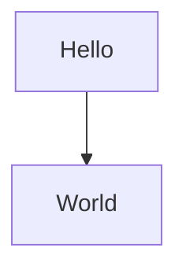
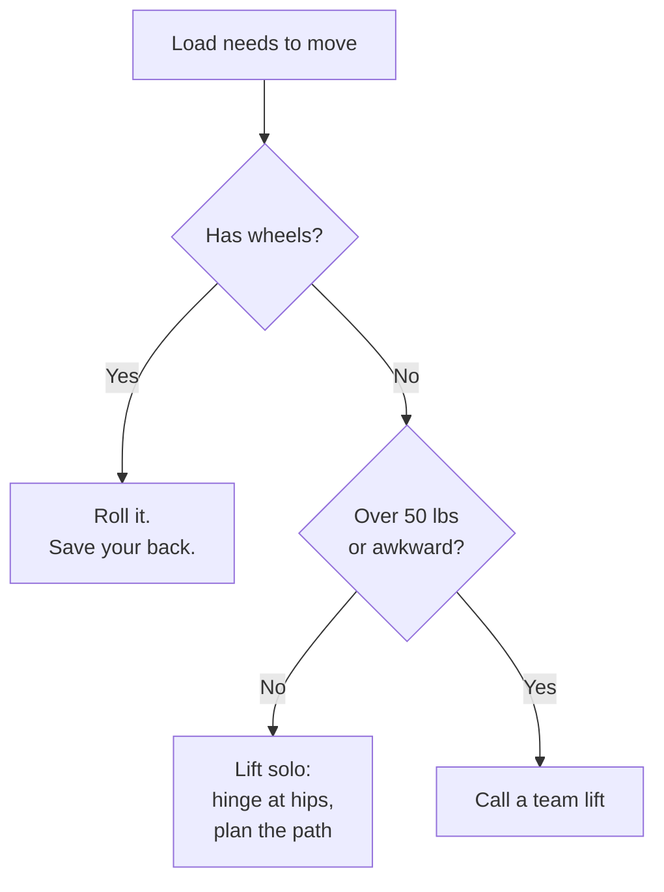
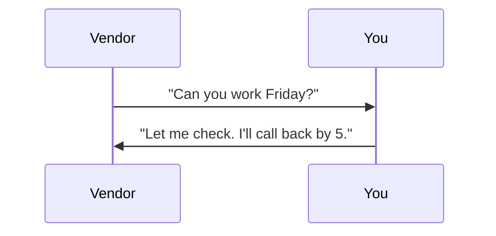
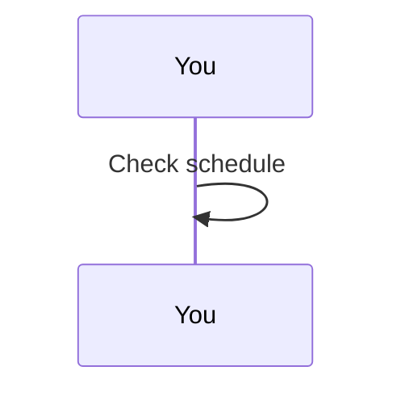
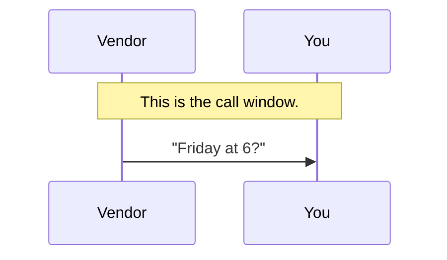
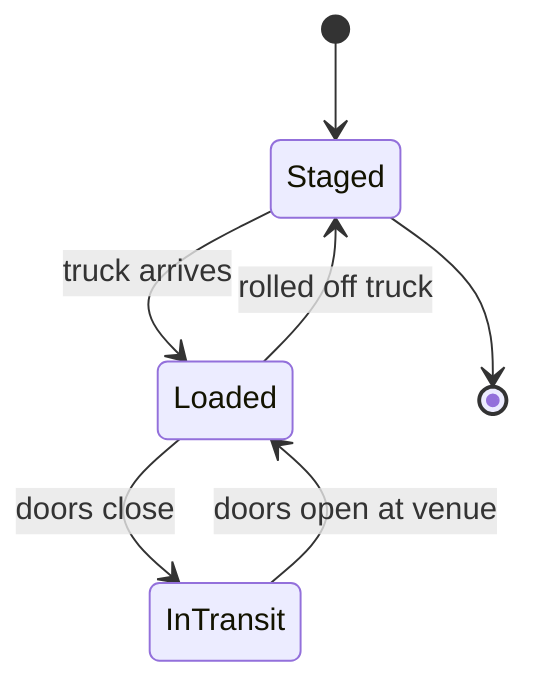
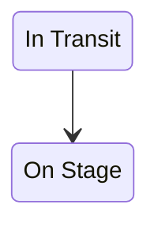
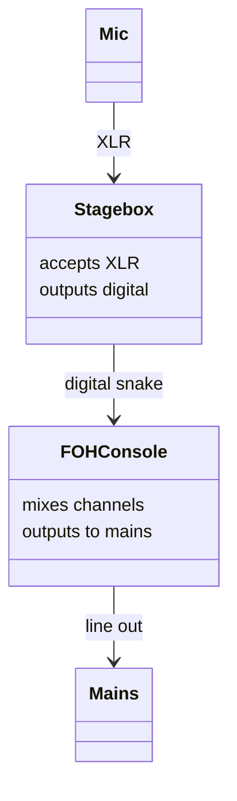

# Mermaid Syntax Reference

Cheat sheet for the four diagram types the diagram-builder skill emits. Scoped to the syntax that renders reliably under Mermaid 10.x via the CDN, with the brand theme variables. Anything not in this file is out of scope for this skill; do not invent fancier syntax.

## General Rules

A Mermaid block in a lesson looks like this:

````markdown

````

Rules that apply to every diagram type:

- The first non-blank line inside the block is the diagram type declaration.
- Indent inner lines with four spaces. Tabs sometimes render but are inconsistent.
- A line beginning with `%%` is a comment.
- Every node id is a short alphanumeric string. Real labels go in the brackets.
- Use `<br/>` for line breaks inside labels. Other HTML is unsupported.
- Wrap a label in double quotes if it contains spaces and special punctuation: `A["With a comma, like that"]`.
- Avoid `&`, `|`, `;`, and stray quotes inside an unquoted label.

## Flowchart

The workhorse. Use for decisions, pipelines, and most "shows the flow" lessons.

### Direction

```mermaid
flowchart TD
```

`TD` is top-down. `LR` is left-right. `BT` is bottom-up. `RL` is right-left. Default to `TD`. Use `LR` for short pipelines.

### Node shapes

| Syntax | Shape | Use for |
|--------|-------|---------|
| `A[Label]` | Rectangle | Default: a step or a state |
| `A(Label)` | Round-corner rectangle | A softer step or a sub-process |
| `A((Label))` | Circle | A transition or a milestone |
| `A{Label}` | Diamond | A decision |
| `A>Label]` | Asymmetric | A note or a hand-off (use rarely) |
| `A[/Label/]` | Parallelogram | Input or output |

For decision flowcharts, use `[Step]` for steps and `{Decision?}` for decisions. Skip the other shapes unless they materially help.

### Edges

| Syntax | Meaning |
|--------|---------|
| `A --> B` | Arrow from A to B |
| `A --- B` | Line, no arrow |
| `A -.-> B` | Dotted arrow (use sparingly) |
| `A ==> B` | Thick arrow (emphasize) |
| `A -->|label| B` | Labeled arrow |
| `A -- label --> B` | Alternate label syntax |

Default to `-->` and `-->|label| B` for decision branches. The pipe-label form is the standard for "yes" / "no" branches.

### Worked example



This is the canonical pattern: decision diamonds, labeled branches, short rectangle nodes for terminal steps.

## Sequence Diagram

Use for two-party (or n-party) exchanges where order matters.

### Structure



`participant V as Vendor` declares a column. `V->>Y: msg` is an arrow with a message label. Quotes inside labels are fine.

### Arrow styles

| Syntax | Meaning |
|--------|---------|
| `A->>B: msg` | Solid arrow with arrowhead |
| `A-->>B: msg` | Dashed arrow with arrowhead (response) |
| `A-)B: msg` | Async (open arrowhead) |
| `A--xB: msg` | Lost message (rare) |

Default to `->>` for the prompts and `-->>` for replies.

### Self-arrows



A participant can send a message to themselves. Useful for "internal step" moments.

### Notes



Use sparingly. A note that just narrates is noise. A note that frames a window of time can earn its place.

## State Diagram

Use for lifecycles. The Mermaid syntax is `stateDiagram-v2` (the v2 version). Do not use the older `stateDiagram` syntax; it has subtle differences and renders worse on the CDN.

### Structure



`[*]` is the start or end state. `A --> B: label` is a transition with a trigger.

### State names

State names are CamelCase identifiers without spaces. If you want a multi-word display, use the explicit form:



Default to single-word CamelCase names. Reach for the explicit form only when the display string really needs spaces.

## Class Diagram

Use sparingly. Pick this only for structural relationships among small sets of entities.

### Structure



`class Foo` declares a class. The brace block lists its attributes. The arrow `A --> B: label` shows the relationship.

### Relationship arrows

| Syntax | Meaning |
|--------|---------|
| `A --> B` | A directly relates to B (default for hardware topology) |
| `A --|> B` | A is a kind of B (inheritance, rare here) |
| `A --o B` | A aggregates B |
| `A --* B` | A composes B |

For most live-event signal-flow uses, plain `-->` is enough. Reach for the typed arrows only if the lesson is specifically about kinds of relationships.

## Theme Variables

The HTML preview generator and static-web sync target initialize Mermaid with these theme variables, so the skill never has to set colors per-diagram:

```javascript
mermaid.initialize({
  startOnLoad: true,
  theme: 'base',
  themeVariables: {
    primaryColor: '#FFFFFF',
    primaryTextColor: '#0A0A0A',
    primaryBorderColor: '#D6006C',
    lineColor: '#0A0A0A',
    tertiaryColor: '#F8F8F8',
    fontFamily: 'system-ui, -apple-system, "Segoe UI", Inter, Helvetica, Arial, sans-serif'
  }
});
```

White background, near-black text, magenta border, near-black lines. Avoid `style A fill:#xyz` overrides in the diagram source. The theme handles it.

## Things to Avoid

- **`graph TD` declarations.** The keyword `graph` still works but is the legacy syntax. Use `flowchart TD`.
- **Subgraphs.** Mermaid supports nested subgraphs but they render inconsistently across CDN versions. Skip them unless the diagram materially needs them.
- **Custom CSS classes.** Mermaid supports `classDef` and `class A myClass`, but they fight the theme. Skip them.
- **HTML inside labels other than `<br/>`.** Pre, code, em, strong - none are guaranteed to render. Stick to `<br/>` for line breaks.
- **Backticks inside labels.** They confuse the markdown wrapper. Use plain text.
- **Long labels.** A label over ~30 characters wraps awkwardly. Break with `<br/>` or shorten.
- **Tabs inside the block.** Some sub-syntaxes choke on tabs. Use four spaces.

## Lint Snippet

For the diagram-builder skill's verify step. Pass the Mermaid block source string through these checks before writing.

```python
def lint_mermaid(src: str) -> list[str]:
    """Return a list of error strings. Empty list = OK."""
    errors = []
    lines = [line for line in src.splitlines() if line.strip()]
    if not lines:
        return ["empty diagram"]
    first = lines[0].strip()
    valid_first = (
        first.startswith("flowchart ") or first.startswith("graph ")
        or first == "sequenceDiagram"
        or first == "stateDiagram-v2"
        or first == "classDiagram"
        or first == "erDiagram"
        or first == "journey"
        or first.startswith("gantt")
    )
    if not valid_first:
        errors.append(f"unknown diagram type: {first!r}")
    for ch_open, ch_close in [("[", "]"), ("(", ")"), ("{", "}")]:
        if src.count(ch_open) != src.count(ch_close):
            errors.append(f"unbalanced {ch_open}{ch_close}")
    if "\t" in src:
        errors.append("contains tabs")
    return errors
```

The snippet is intentionally simple. It will not catch every Mermaid syntax error, but it catches the ones the skill is most likely to introduce. Beyond this, the visual sanity check is reading the diagram out loud and asking "does the prose around this match the structure I just drew?"
