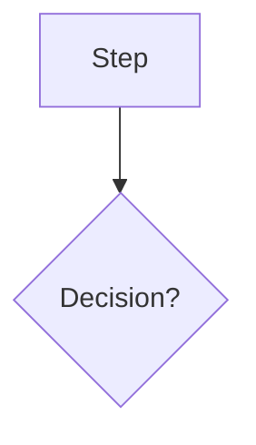

# Static Web Sync

Renders the course's units to standalone HTML pages. The same code generates the local preview pages and (when invoked with a deploy target) ships pages to a static site.

This is the **Phase 6 implementation**. Sync to a hosted target (GitHub Pages, Netlify, etc.) is still Phase 4 work; this skill currently produces preview HTML files locally. The rendering pipeline is the part Phase 7 (MicroSims) will reuse.

## When to Use

After lessons and knowledge checks are populated. Run before showing a unit to a stakeholder for review, after running `bes add-diagrams` to confirm Mermaid blocks render, or any time you want to eyeball the unit on the page rather than as a markdown source.

Do NOT use this skill if:
- The unit has no lessons yet (preview will be empty)
- The lesson markdown does not parse (run `bes validate` first)

## Steps

1. Verify environment:
   - `course-config.yaml` exists and parses
   - At least one unit folder under `content/`

2. Load configuration:
   - Read course-config.yaml for course metadata (name, slug)
   - Read course-description.md for the tagline (the first paragraph after the H1)

3. For each unit folder (filtered by `units_to_render` if provided):
   - Read `unit.yaml` for unit number and title
   - List lessons in `lessons/`, sorted by filename
   - Read each lesson's frontmatter and body
   - Read `knowledge-check.yaml`

4. Render the page using the template in `lib/preview.py`. The template:
   - Inlines the brand CSS (white background, near-black text, magenta D6006C accent)
   - Includes the Mermaid CDN script in `<head>`
   - For each lesson, renders the markdown body with markdown-it
   - For each ` ```mermaid ` fenced code block in the markdown, emits a `<div class="mermaid">...</div>` instead of a `<pre><code>...</code></pre>`. The Mermaid CDN script then turns that div into rendered SVG client-side.
   - Centers diagrams horizontally via the `.mermaid` CSS rule
   - For each knowledge check question, renders a collapsible `<details>` element with the question, choices, correct answer, and explanation
   - Initializes Mermaid at the end of `<body>` with brand theme variables

5. Write one HTML file per unit to `output_dir/unit-NN-preview.html`.

6. Show the user a summary: number of pages rendered, paths, and a hint about opening them in a browser.

## Mermaid Rendering

Mermaid blocks in lessons look like:

````markdown

````

The renderer recognizes the `mermaid` info string on a fenced code block and emits:

```html
<div class="mermaid">
flowchart TD
    A[Step] --> B{Decision?}
</div>
```

The CSS centers and bounds the diagram:

```css
.mermaid {
  margin: 1.5em auto;
  text-align: center;
  display: flex;
  justify-content: center;
  font-family: system-ui, -apple-system, "Segoe UI", Inter, Helvetica, Arial, sans-serif;
}
.mermaid svg {
  max-width: 100%;
  height: auto;
}
```

The Mermaid library is loaded from the CDN in `<head>`:

```html
<script src="https://cdn.jsdelivr.net/npm/mermaid@10/dist/mermaid.min.js"></script>
```

And initialized at the end of `<body>` with brand theme variables:

```html
<script>
mermaid.initialize({
  startOnLoad: true,
  theme: 'base',
  themeVariables: {
    primaryColor: '#FFFFFF',
    primaryTextColor: '#0A0A0A',
    primaryBorderColor: '#D6006C',
    lineColor: '#0A0A0A',
    tertiaryColor: '#F8F8F8',
    fontFamily: 'system-ui, -apple-system, "Segoe UI", Inter, Helvetica, Arial, sans-serif'
  }
});
</script>
```

## Why CDN, Not Inlined

The CDN approach assumes the reviewer has internet when they open the preview. That is true for local review and almost all stakeholder-share scenarios.

For truly offline / air-gapped previews, swap in a build-time pre-render via `@mermaid-js/mermaid-cli`. The renderer detects a `--prerender` flag and substitutes inline SVG in place of the `.mermaid` div. This is documented in `lib/preview.py` but not the default path.

## Final Assessment Retest Behavior (Phase 14)

When the rendered course final has the Phase 14 fields set (or relies on defaults), the test-mode JS:

- Reads prior attempts from `localStorage` under `course-{slug}-final-attempts`.
- Shows "Attempt N of M" once max_attempts is greater than 1.
- Samples questions for each attempt with overlap-aware logic: prefer entirely fresh questions, fall back to a capped reuse pool when the bank is too small, and prefer previously-wrong questions when reuse is unavoidable.
- After submit, appends a record `{ attempt_number, question_ids, wrong_ids, score, passed, timestamp }` to localStorage and shows a retake button if attempts remain.
- After max_attempts is hit, hides the form and shows the configured `retest_lockout_message`.

### Author tools

- `?reset=true` clears the localStorage attempt record on page load. Useful while testing the page.
- `?author=true` reveals a small Reset button at the bottom of the section. Clicking it clears localStorage and reloads.

### Limitations

- localStorage is client-controlled. A determined student can clear browser data to reset attempts. For real assessment integrity use the LMS targets (Thinkific, Canvas) that track attempts server-side.
- `attempts_persist_across_sessions: false` in the YAML disables localStorage entirely. Each page load is a fresh attempt with no overlap enforcement.
- The retest sampler is a best-effort algorithm. If the validator warned that the configured (bank, per-attempt, attempts, overlap) is mathematically impossible, late attempts may serve fewer than `questions_per_attempt` questions because the constraint takes priority over the count.

## Knowledge Check Rendering Mode

Each unit's knowledge check renders in one of two modes:

- **study** (default): each question shows its choices, then a `<details>` collapsible labeled "Show answer" that reveals the correct choice and explanation. Suited for self-paced practice where the student wants the answer right there.
- **test**: each question renders with radio inputs, the unit's KC ends with a Submit button, and after submit the student sees a score, a pass/fail badge, and a "Show correct answers and explanations" reveal button. No localStorage tracking, no retest cap; refresh to retry.

### Resolution order (3 layers)

1. **Per-quiz override.** A unit's `knowledge-check.yaml` may set `mode: "study"` or `mode: "test"` (top-level, or nested under `quiz:`). This wins.
2. **Course default.** `course-config.yaml` may set `knowledge_check_mode: "study" | "test"` under the `course:` block. This applies to every unit in the course unless that unit overrides.
3. **Toolkit default.** "study". Applied when neither of the above is set.

### Example

```yaml
# course-config.yaml — turn on test mode for the whole course
course:
  knowledge_check_mode: "test"
```

```yaml
# content/unit-04-easy-review/knowledge-check.yaml — but Unit 4 stays study
quiz:
  mode: "study"
  title: "Unit 4 Knowledge Check"
  questions:
    - id: u4-kc-01
      ...
```

### Test-mode KC vs course final

KC test mode is intentionally lighter than the course final. The Phase 14 retest features (max_attempts, max_overlap_percentage, attempts_persist_across_sessions, retest_lockout_message) only apply to the course final assessment. KC test mode skips localStorage entirely; each page load is fresh, refresh to retake.

## Thinkific Note

Thinkific's lesson sandbox may strip or sandbox the `<script>` tag for the Mermaid CDN, so on Thinkific the recommended pattern is to pre-render Mermaid to inline SVG before pushing. The Thinkific sync target handles that conversion at sync time. The static-web preview pipeline does not need that conversion since it runs in a normal browser.

## Files in This Skill Folder

- `SKILL.md` (this file)
- `lib/preview.py` (the HTML preview generator)
- `lib/__init__.py`

## Changelog

### 0.1 (Phase 4 placeholder)
- Stub only.

### 0.2 (2026-05-04, Phase 6)
- Initial real implementation.
- Renders one HTML page per unit with brand CSS, Mermaid CDN, and the
  collapsible knowledge-check pattern from the test course's preview.
- Mermaid blocks render as `<div class="mermaid">` so the Mermaid library
  turns them into SVG client-side.

### 0.3 (2026-05-05, Phase 14)
- Final assessment honors `max_attempts`, `max_overlap_percentage`,
  `retest_lockout_message`, and `attempts_persist_across_sessions`.
- Overlap-aware sampling, localStorage-backed attempt tracking,
  attempt counter, retake/lockout UI, and `?reset=true` / `?author=true`
  query params for course-author testing.

### 0.4 (2026-05-05)
- Layered `knowledge_check_mode` ("study" or "test") for unit
  knowledge checks. Per-quiz `mode:` key in knowledge-check.yaml
  beats course-config `knowledge_check_mode` beats toolkit default
  ("study"). KC test mode is a simple submit-and-reveal flow that
  skips Phase 14 retest tracking; refresh to retry.
